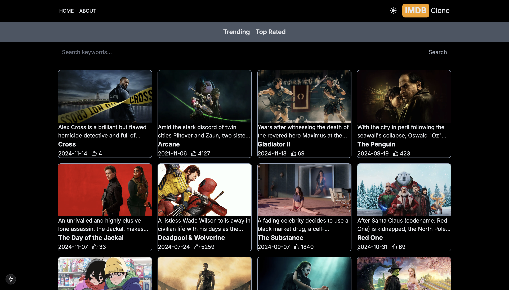
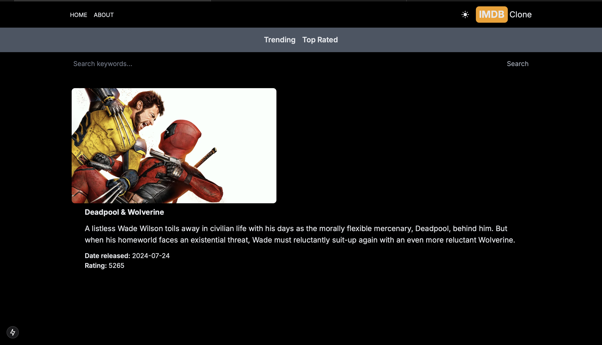
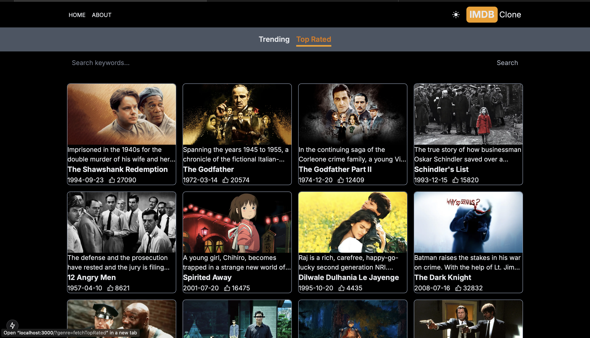
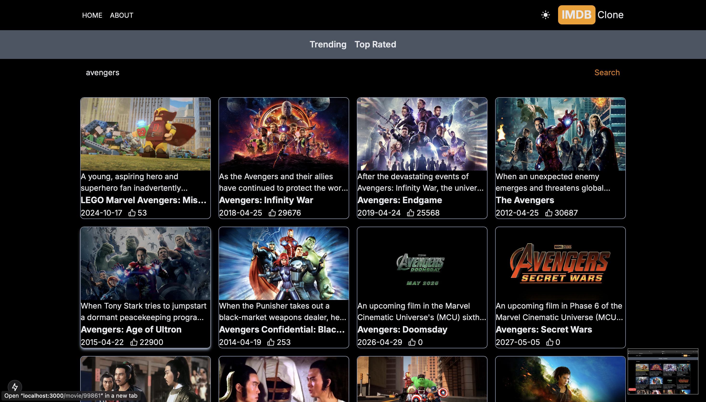

# 🎥 IMDb Clone  

An IMDb-like movie database application powered by TMDB API, built using **Next.js**, **React**, and **JavaScript**. This project showcases trending and top-rated movies, includes a search feature, and provides individual movie descriptions in both **dark mode** and **light mode**.  

## ✨ Features:  
- 🎞️ **Trending and Top-Rated Movies**: Stay updated with the latest popular movies.  
- 🔍 **Search Functionality**: Easily find your favorite movies by name.  
- 🌓 **Dark & Light Modes**: Toggle between light and dark themes for an optimized viewing experience.  
- 📄 **Detailed Movie Descriptions**: Click on any movie to view its details.  

## 🌐 Tech Stack:  
    
   

## 📸 Screenshots:  

### Home Page:  
  

### Movie Info Page:  
  

### Categories:  
  

### Search Movie:  
  


## 🚀 How to Run:  
1. Clone the repository:  
   ```bash  
   git clone https://github.com/helloAmulya/imdb-clone.git  
   cd imdb-clone  
